# The Tiniest Raspberry Pi Synth
Have you ever heard of MIDI? The _Musical Instrument Digital Interface_ is a well established technology used to tell computers how to play sounds and a staple in moderm music production.
_MIDI controllers_ are probably its most popular application. Simple pieces of equipment that can't produce sounds on their own, yet are very expressive when coupled with good music production software.
In this guide, we are going to assemble a tiny software sinthesizer using a Raspberry Pi Zero and a few audio devices.

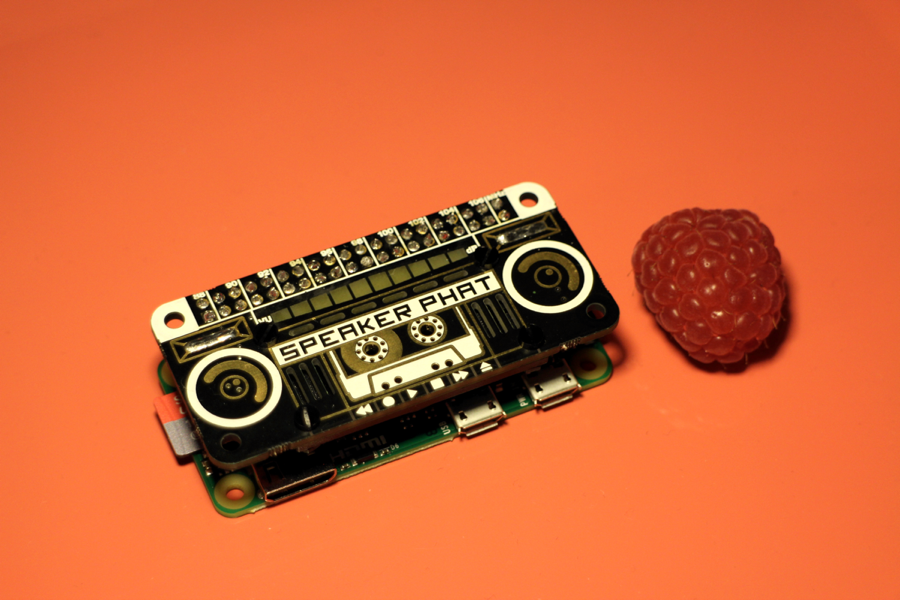

## Ingredients
Besides your Raspberry Pi Zero and the usual essential power adapter and micro SD card, you are going to need at the very least:

- A sound interface and speakers (or headphones) to make sounds. Here I'm going with the incredibly fun Pimoroni Speaker pHAT, more on it later.
- A USB MIDI controller to play on. Any type you want, although keyboards, drum pads and guitars work best for this guide. You can even build your own _Monome-like_ device, if you feel exceptionally crafty.
- A USB to micro-USB adapter for your MIDI controller, unless it features a micro-USB plug already.

Optionally:

- If you can't connect your Pi Zero to the local network, you'll need keyboard and monitor to work via command line. A recent TV makes a perfect monitor. Remember that the Zero has micro USB and mini HDMI ports, so you'll most likely need adapters.
- Working on the Pi Zero over the network requires a network interface. The lucky owners of Raspberry Pi Zero model W will enjoy their embedded wi-fi interfaces, all the others will need a USB wi-fi or ethernet dongle.
- A USB hub always comes in handy when you are dealing with multiple devices and you are constrained to a single port, but if the MIDI controller is your only USB device, then you are not going to need a hub.

You can stop here in case you are using a USB sound interface. If you're set on following my lead, instead, you are going to need a few more things to assemble the GPIO sound card:

- Soldering iron and some solder.
- A 2x20 0.1" male GPIO pins header, like [this one][adafruit-pin-header].

## The sound interface
The Pi Zero doesn't have any on-board speakers and if you've ever seen any of the bigger models, you've probably noticed that it doesn't have any audio outputs either. Unlike the rest of the Raspberry Pi family, in fact, the Zero ships without an integrated audio filter. It's one of the trade-offs of its very compact size.

No worries, we have plenty of options. For the purpose of this guide, I'm going to be using the Speaker pHAT, a sound card developed by the excellent folks at Pimoroni which connects to the Raspberry Pi through the GPIO pins and communicates over the I2S bus. You don't actually need to know what all of that means, but if you are curious there is tons of documentation on the [Raspberry Pi website][gpio].
I chose the Speker pHAT because it integrates the two main components that are actually necessary to produce sounds in a single board: a Digital-to-Analog audio Converter, or DAC, and a speaker. Also, since it connects over GPIO, it leaves me free to use the one micro-USB port available on the Pi Zero, contributing to the overall lilliputian format.

Oh, and did I mention that it looks _really_ cool? Look at that LED vu meter.
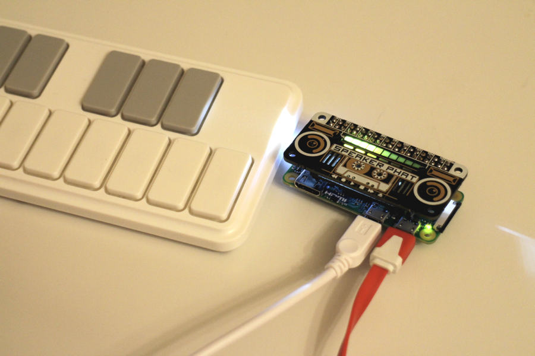

Naturally, the tiny 2W speaker brings some compromises. As per the manifacturer's own admission, we can't expect audiophile quality or loud volumes. I don't mind, though. After all, I want an ultra portable synth.

If you are looking for higher quality, instead, you'll probably want to go with a better GPIO sound card and external speakers or headphones.
If you want to avoid soldering altogheter, a cheap USB soundcard will be prefectly suited for the job, but it will add a USB hub to the list of requirements.

Let's get started!

## Hardware setup
Assuming you are still with me and committed to the GPIO sound card approach, you're up for some soldering now. Those of you going for the USB audio solution instead may just plug in the sound card and skip this whole section.

Start with soldering the male GPIO pin header to the Raspberry PI Zero, making sure that the pins point upwards, like this.
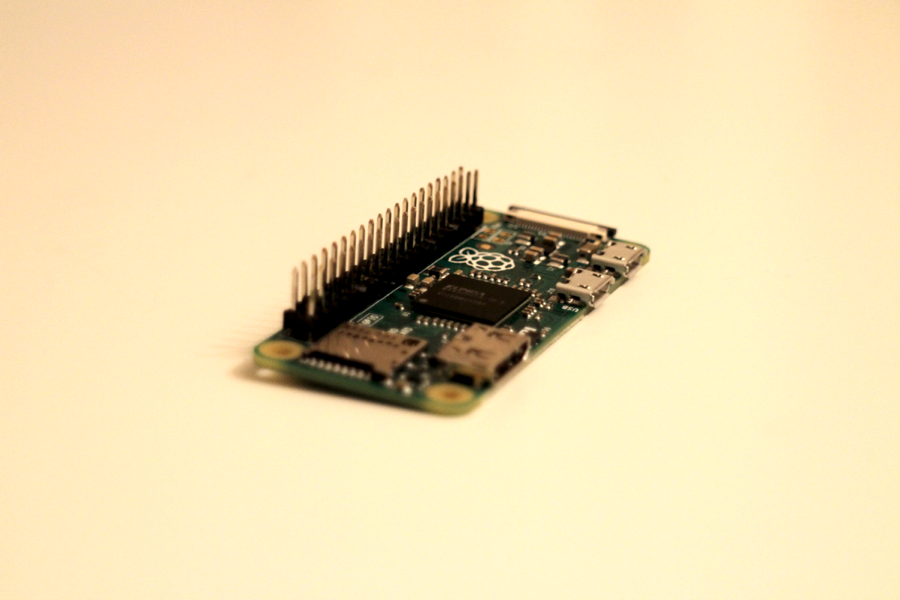

If you find difficult to immobilize the pins while soldering, try wrapping some masking tape around the mounted header. Solder a few pins on both sides, then remove the tape and finish the work.

You'll then need to assemble your Speaker pHAT following the [instructions][spekaer-phat-guide] provided by Pimoroni.
Start by soldering the female GPIO header included in the kit in just the same way you did for the male header, this time making sure that the socket is attached to the back side of the board.
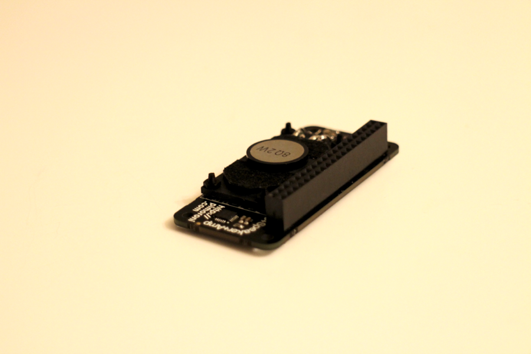

Finish up by mounting the speaker and solder its contacts.
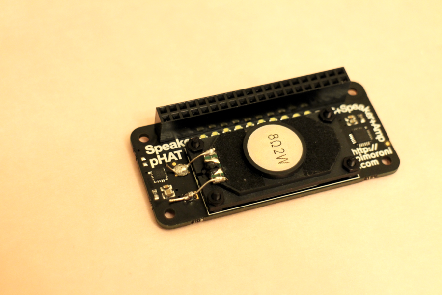

Connect the pHAT to the Pi and pat yourself on the shoulder. You're done!

Coming up next, software.

## System setup
Like any other Raspberry Pi projects, the first thing we need to do is writing the operating system image onto the SD card, so head over to [raspberrypi.org][raspbian] and get the latest Raspbian OS. The _lite_ version is all we need, in fact a smaller system means more computational resources available to run the software synthesizer smoothly.
Follow the latest [installation guide][raspbian-installation] for your OS on the Raspberry Pi website to learn how to prepare the micro SD card with Rapsbian.

If you want to access your Zero over the network, create an empty text file called `ssh`, no extension, in the card's `boot` partition. That will enable the _SSH daemon_ and allow you to log into the Pi operating system using the `ssh` client or `PuTTY`.
In order for the Zero to connect to the local wi-fi, you'll need to provide name and password for the network. In the same `boot` partition, create a `wpa_supplicant.conf` text file. Its content should look like this:
```
ctrl_interface=DIR=/var/run/wpa_supplicant GROUP=netdev
update_config=1

network={
  ssid="Your WiFi SSID"
  psk="your-password"
}
```
Replace the sample SSID and password with your credentials, watching for the correct letter case, and save the file.

### First access
Get that freshly baked SD card into the Pi, connect whatever's needed to get control over the running OS (keyboard and monitor or the network adapter) and finally plug in the power supply. The tiny green LED should light up and if you've plugged in a monitor, you'll see the linux system booting up.
To access via SSH, wait a few minutes then try to `ping raspberrypi.local` from your command line. If the Zero connected to the network successfully, it'll reply to the ping and you'll get to know its IP address.

Log into the system with the default user name - `pi` - and password - `raspberry`. As you access for the first time, you are likely going to get a warning message suggesting you to change the default password for the `pi` user. You know, security.
It isn't a bad idea to do so, especially if your Zero is connected to the network. While we're at it, we can also take care of a few more configuration details.

At the command prompt, run `sudo raspi-config`.
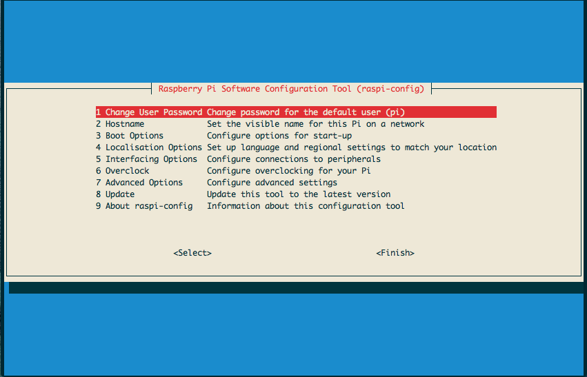
Raspi-config is a utility that ships with Rasbian OS which makes tweaking system settings very easy. Go ahead and change that password.
You'll want to adjust a few more things before hitting the `Finish` button.

`Localisation Options` sets the default _locale_. You are not actually required to change anything here, but I noticed that installing new packages will show you a few warning messages if there isn't a default locale set. Take a minute to set it up, it'll pay back with less verbose installation output.

Since we are going to run our Pi in _headless mode_, we can reallocate some of the GPU memory to be part of the system-wide pool.
From the main raspi-config menu, go to `Advanced Options`, then `Memory Split` and dial the GPU memory down to `16`mb.
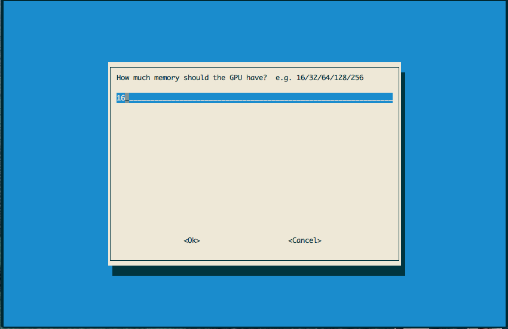

Hit `Finish` when done, you'll be asked to reboot.

Back at the login prompt, login again as the `pi` user, this time using the new password you just set.

### Installing the Speaker pHAT drivers
Pimoroni provides both drivers and installation instructions for the Speaker pHAT on [their github page][speaker-phat-gh].
The setup script will take a few minutes to run and it will ask you to install a few additional packages along the way, like a python module to program the vu meter LED bar on top of the board and the _python3_ runtime library. Some of these things are unnecessary for what we are doing, but it's generally a good idea to install all of the options. You will have a fully consitent environment and get additional development libraries that can always be used to play around with the hardware.

Wait for the setup process to complete and then check the settings of your sound card by running `alsamixer`. Turn up the volume a notch or two.
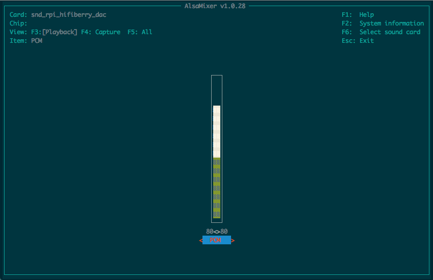

### Installing fluidsynth
Time to install the most important piece, the software synth. I chose `fluidsynth` for this project because it's open source, very simple to set up and compatible with the `SoundFont2` specifications, an old standard still widely adopted today that will allow us to benefit from an infinite collection of sound banks from around the internet, or even create our own bank from recorded samples.

This part is easy, good old _apt-get_:
`sudo apt-get update && sudo apt-get install fluidsynth`
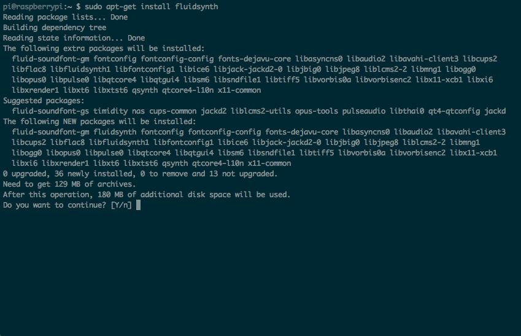

Another lengthy installation process, mostly due to the numerous dependencies.

Fluidsynth ships with a default _soundfont_ bank called `FluidR3_GM`, where _GM_ stands for the [General MIDI][wikipedia-gm] standard, and that gives you quite a few instruments to play with.

Launch fluidsynth with:
`fluidsynth -a alsa -g 1 /usr/share/sounds/sf2/FluidR3_GM.sf2`
By passing those options, we're asking fluidsynth to use the _ALSA_ audio driver, set the gain value to `1` (0 is silent, 10 is freaking loud) and to load the _GM_ sound bank.
In addition to starting the synthesizer process, this command will also prompt you with the fluidsynth _shell_, which you can use to play the synthesizer _programmatically_. Ignore any warning messages you might get, for the moment. Feed the following line to the shell, then press enter:
```
> noteon 0 69 127
```

Sweet! You heard that? We told fluidsynth to process the `noteon` signal, which is what MIDI controllers produce when you push the tone keys. The rest of the line are its parameters.

`0` is the MIDI channel. You have 15 of them, all allocated to the Grand Piano instrument by default. Type `inst 1` to see a list of all the instruments available in the sound bank, then `prog` to assign them to a channel. For instance, to get some synth drums on channel 1, type `prog 1 118`.
`69` is the MIDI tone, a number used to encode specific sound frequencies - namely, the musical notes - into a value that can be exchanged over the wire. `69` maps to the note`A4` on your keyboard, `70` to `Bb`, `68` to `G#`, and so on, each number moving over the scale by a semitone.
Finally `127` is the MIDI _velocity_, a parameter used to encode the energy applied on a key. Try the same command with a velocity of `50` for a softer sound.
All those commands and parameters are documented on the fluidsynth [user manual][fluidsynth-manual].

Go on and play around with the shell. Once you're done, press `ctrl+c` or type `quit` to go back to the sytem prompt and move on to the next step.

### Hooking up the midi controller
Go get your USB MIDI keyboard or drum pad and keep it handy.
Type `aconnect -i` in the command prompt, you'll get back the list of the _input_ MIDI devices visible to the system. There is nothing interesting in that list just yet, but if you plug in your USB controller and re-type the same command, your controller should show up, looking somewhat like this:
```
client 20: 'nanoKEY2' [type=kernel]
    0 'nanoKEY2 MIDI 1 '
```
Now let's start fluidsynth again, this time passing a couple of new parameters:
`fluidsynth -is -a alsa -g 1 /usr/share/sounds/sf2/FluidR3_GM.sf2 &`
The `i` and `s` arguments tell fluidsynth to start in _no shell_ and _server_ mode, so we won't get a command prompt. In addition, we appended `&` at the end of the line to send the process to the background.

Run `aconnect -o` to list the _output_ devices. We expect fluidsynth to be one of them.
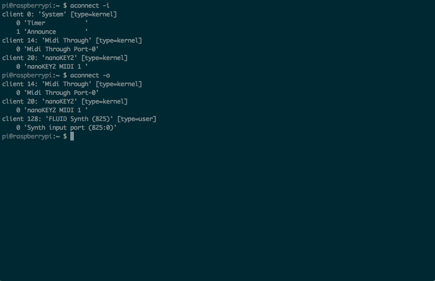

Last thing left to do is telling _ALSA_ to route any signals coming from the MIDI controller over to fluidsynth, basically the software equivalent of running a cable from your instrument to an amplifier.
Take a look at the _client names and numbers_ of both your MIDI controller and fluidsynth. In my case, my nanoKEY2 controller is client number `20`, port `0` and fluidsynth is client `128`, port `0`.
To connect them, provide either their names or their numerical identifiers to the command `aconnect`, like so:
`aconnect 20:0 128:0`

A word of advice. USB client identifiers may change at reboot or if you plug your device into different ports, but the name won't change. On the other hand, the fluidsynth ID will most likely stay the same, but its name will change because it contains the current linux process number. Therefore your best bet for an all-occasions command to connect your MIDI controller to fluidsynth looks like this:
`aconnect 'midi name':0 <fluidsynth-id>:0`
So in my case:
`aconnect 'nanoKEY2':0 128:0`

Alright! Time to play some tunes.

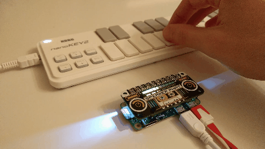

### Booting up as a synth
There's one last step left: getting rid of all these cables and adapters and configure the Pi to load fluidsynth every time we plug in the power.
Linux systems have many different ways to achieve that, but there's a super easy solution for Raspbian.
`sudo nano /etc/rc.local`
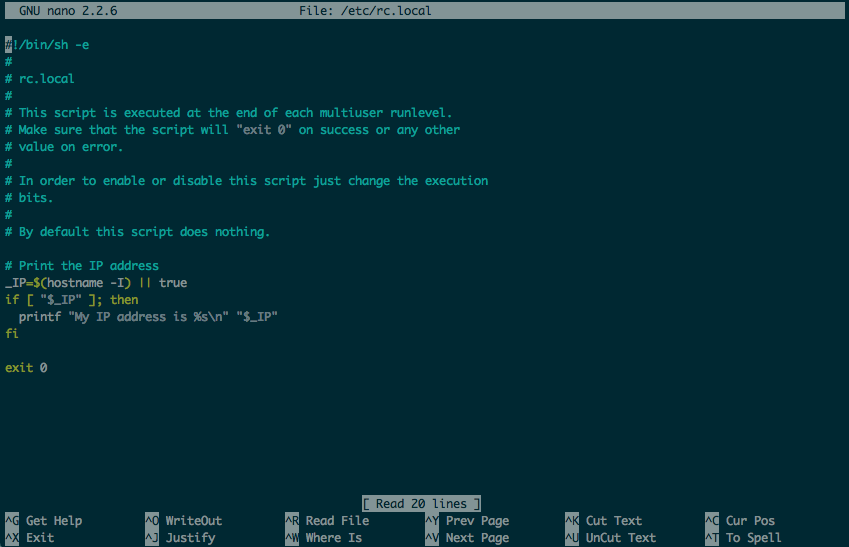

`rc.local` is a script executed by the system at the end of every boot cycle, perfect for those instructions we want to run only once at startup.

Add these lines to the script, paying attention to leave `exit 0` as the last line of the file. It ensure that the system boots despite any mistakes we might make with the rest of the instructions.

```bash
CONF_FILE=/home/pi/fluidsynth.conf
SOUNDBANK=/usr/share/sounds/sf2/FluidR3_GM.sf2
SYNTH_OPTIONS="-is -a alsa -z 1024 -c 8 -o audio.realtime-prio=95"

nice -19 fluidsynth $SYNTH_OPTIONS -f $CONF_FILE $SOUNDBANK &

sleep 10

aconnect 'nanoKEY2':0 128:0

exit 0
```

Okay, let's try to break that down. Lines 1 through 3 are local _variables_. The first one refers a fluidsynth configuration file, we'll talk about it in a moment. Line 2 is the path to our GM sound bank. Line 3 is a set of fluidsynth options introducing a few new entries. 
`-z` and `-c` configure the audio buffer. You will need them only if you are using the Speaker pHAT and they should make any warning messages you received previously disappear. 
`-o` sets generic fluidsynth settings, in this case `audio.realtime-prio=95`, which grants higher execution priority to the audio thread, making the synth more responsive.

Line 4 in the script starts fluidsynth passing the content of the variables from lines 1 through 3 as arguments. Also, `fluidsynth` is prepended with `nice -19`, another trick to improve the synth performances.
`nice` is a unix command that alters the _scheduled priority_ of a process. You can find more details on its `man` page, but fundamentally it will allow fluidsynth to use more CPU time than it would as a regular process.

Lines 5 and 6 should be clear: wait 10 seconds for the synth to start, then connect it to the MIDI controller. Remember to use your own MIDI client identifiers.

Once you've finished editing you `rc.local` file, press `ctrl+o` and `ctrl+x` to save and quit the nano editor.

Remember the configuration file we assigned to the `CONF_FILE` variable? That's fluidsynth's own startup script and we are going to use it to pre-load the synth channels with the configuration of instruments we like best.

At the terminal prompt, type `nano /home/pi/fluidsynth.conf` and write your own channel setup based on this example:
```
# Any text after a # symbol is ignored, a convenient way to annotate the file.
# Here's a list of 'select' commands preloading my channels.
# The parameters are: channel, soundfont, bank, instrument

select 0 1 0 81   # sawtooth synth
select 1 1 8 24   # ukulele
select 2 1 0 2    # electric piano

# Finally, set the gain
gain 1
```

Save and exit nano, `sudo reboot` and enjoy your new super compact MIDI synthesizer.

## Hungry for more?
Here are some ideas to keep developing your project.

Reduce the system latency for a more responsive MIDI instrument. Sound synthesis is a very CPU-intensive process and we just scratched the surface in terms of performances. Try disabling as many unnecessary system services as possible to gain a small boost and learn how to compile a real time linux kernel.

Replace fluidsynth with `amsynth` and unleash your inner sound nerd playing with its emulated oscillators and filters.

Try running your Pi Zero from a USB power bank or add a LiPo battery to make your project _really_ portable.

And finally, Raspberry Pi Zero or not, take a look at Sam Aaron's [Sonic Pi][sonic-pi] and [Overtone][overtone], two fantastic music hacking environments for live coding performances.

[adafruit-pin-header]: https://www.adafruit.com/product/2822
[gpio]: https://www.raspberrypi.org/documentation/hardware/raspberrypi/gpio
[spekaer-phat-guide]: https://learn.pimoroni.com/tutorial/sandyj/assembling-speaker-phat
[raspbian]: https://www.raspberrypi.org/downloads/raspbian
[raspbian-installation]: https://www.raspberrypi.org/documentation/installation
[speaker-phat-gh]: https://github.com/pimoroni/speaker-phat
[fluidsynth-manual]: https://sourceforge.net/p/fluidsynth/wiki/UserManual/
[wikipedia-gm]: https://en.wikipedia.org/wiki/General_MIDI
[sonic-pi]: http://sonic-pi.net
[overtone]: http://overtone.github.io