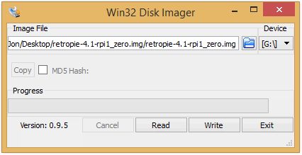
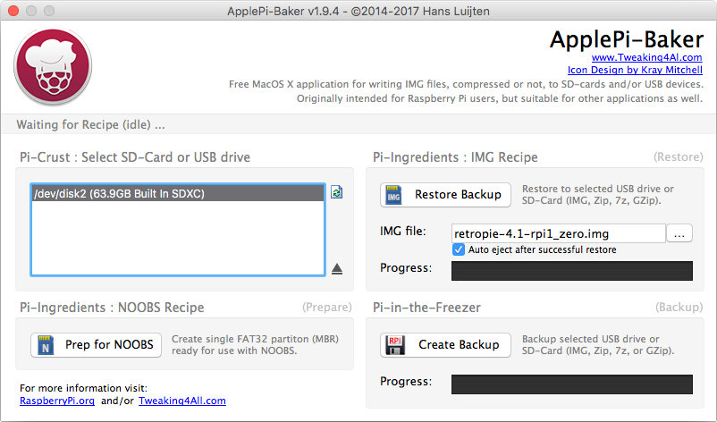
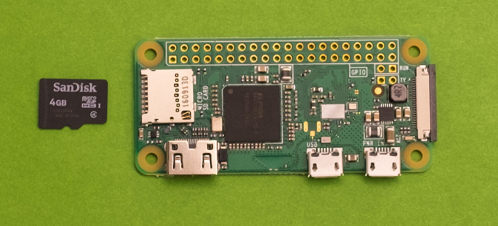
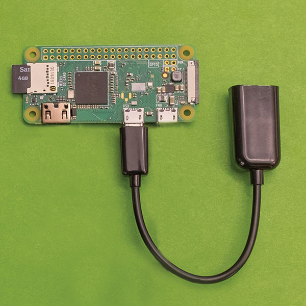
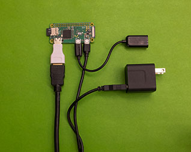
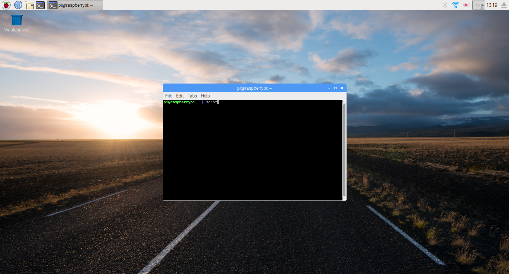
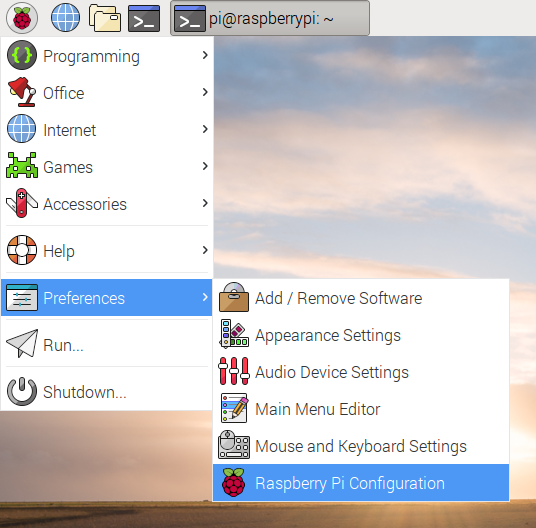
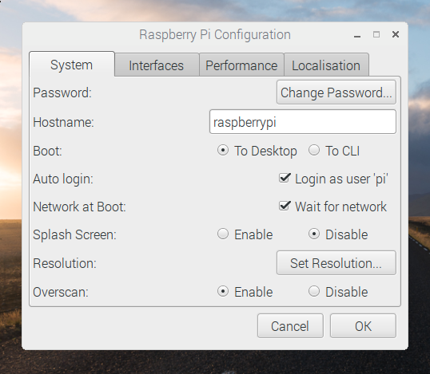
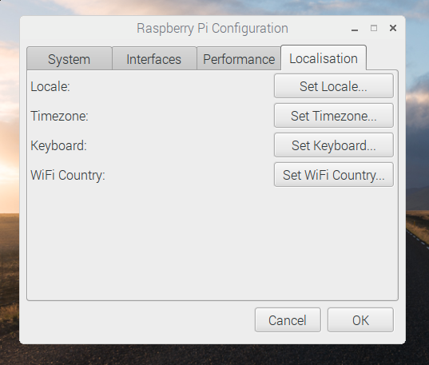
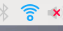

Panda Cam Monitor
=================

Description
-------------------
Using [Raspbian's][raspbian-site] startup settings, you can configure your Raspberry Pi Zero to start up and launch the web browser in fullscreen for a webpage of your choice. At Zipcar, we're fans of the San Diego Zoo's Giant Panda Cam (but you can use this tutorial to set up a monitor for any site you wish).

Time estimate
-------------
30 minutes

Difficulty
----------
Over Easy

Ingredients
-----------
#### Physical things
- 1x HDMI cable
- 1x HDMI display (most modern televisions have an HDMI port)
- 1x keyboard (needed for setup)
- 1x micro USB AC power plug
- 1x micro USB to USB adapter (needed for setup)
- 1x mini HDMI to HDMI adapter
- 1x Raspberry Pi Zero


#### Virtual things
- [Raspbian][raspbian-download]
- [Win32DiskImager][win32-disk-imager-download] (Windows only)
- [ApplePi Baker][applepi-baker-download] (Mac only)


#### Knowledge things
- How to download and manipulate files on your computer
- How to extract .zip files on your computer
- Configuration of your WiFi access point


#### Step 1 - Download and Prepare Raspbian
(Raspberry Pi has an image installation guide covering more options, [here][generic-image-install-guide])

- Download Raspbian from the link in Ingredients, above
- Extract the file you just downloaded (ends with ".zip"); you should end up with an image file (ends with ".img"). Save the image file somewhere you can get to it in the next step.
- Download and install [Win32DiskImager][win32-disk-imager-download] (Windows only) or [ApplePi Baker][applepi-baker-download] (Mac only)


#### Step 2 - Install Raspbian
**IMPORTANT:** in the following steps, be careful to only select your SD card drive - all the data on the selected drive will be overwritten and lost!

- Insert your microSD card (via SD adapter if needed) into your computer
- **(Windows)** Open Win32 Disk Imager and select the image file your downloaded.
- **(Windows)** Under "Device", make sure the drive for your SD card is selected and click the "Write" button


- **(Mac)** Open ApplePi Baker and look for the "Pi-Crust" section. Make sure your SD card is selected.
- **(Mac)** Now look for the "Pi-Ingredients" section. Load the image file you downloaded, and click the "Restore Backup" Button



#### Step 3 - Plugging in your cables and power on Raspbian
- Insert your microSD card into your Pi Zero:

- Plug your micro USB to USB adapter into the micro USB port on the Pi Zero labeled "USB":

- If you have a keyboard with a touchpad or wireless keyboard / mouse combination, you may want to use that for setup. If you require two USB ports for your mouse and keyboard, you'll need to plug them into a USB hub, which you can plug into the USB adapter now. Otherwise, plug the single USB/Keyboard adapter into your micro USB to USB adapter. This is just for set up - once your Raspbian installation has been configured to boot to the webpage, you won't need a keyboard or mouse.
- Connect your Pi to the HDMI port of your HDMI display with an HDMI cable
- Next, you will power on and boot the Raspberry Pi by plugging it in, so double check that everything else so far is plugged in and your display is set to the correct HDMI input.
- Plug in the micro USB AC power plug into the micro USB port on the Pi Zero labeled "PWR IN":

- After a few seconds, you should see a series of Raspberry Pi load screens. It may take a few minutes for the Raspberry Pi to get set up this first time powering on, so don't panic if it takes longer than expected. When everything is finished, you should see a Windows/Mac-like desktop:



#### Step 4 - Configuring Raspbian
- Open the Raspbian menu (click leftmost icon in the toolbar which looks like a raspberry) and navigate to "Preferences", then "Raspberry Pi Configuration". A pop-up will open with multiple tabs.





- In the configuration window, select the "System" tab and make sure the "Wait for network" option is checked.
- Raspbian's keyboard configuration defaults to UK settings - navigate to the "Localisation" tab in the configuration window and select "Set Keyboard" to set your keyboard language.



- You may also wish to update your other localization settings at this point; under "Localisation", you'll have option buttons to adjust your settings for locale (region language), Timezone, Keyboard, and WiFi Country.
- In the top right corner of your toolbar, click the network icon and select your wireless access point.



#### Step 5 - Configuring Autostart
- We're now going to use Raspbian's Terminal to add some settings to the autostart file. Start by clicking the terminal icon in the toolbar at the top of the screen.


- Type the following into the terminal:
`sudo nano .config/lxsession/LXDE-pi/autostart`
> PROTIP: you can use `vi` instead of `nano`, which is just another way to edit the file

- Look for a line in the file that says `@xscreensaver -no-splash` and put a `#` in front of it, so the line reads `#@xscreensaver -no-splash`
- Next, you want to use the text editor in Terminal to add the following lines to the end of the file:
```
@/usr/bin/chromium-browser --allow-running-insecure-content --disable --disable-infobars --disable-save-password-bubble --disable-session-crashed-bubble --disable-suggestions-service --disable-translate --incognito --no-first-run --noerrdialogs --remember-cert-error-decisions --start-maximized --kiosk http://zssd-panda.player.camzonecdn.com/v1.0/CamzoneStreamPlayer?iframe=yes&channel=zssd-panda&muted=yes
@xset s off
@xset s noblank
@xset -dpms
```
- Save your changes by pressing the `Control` and `x` on your keyboard, then `y`, followed by `enter` to accept the changes and close the file.

> PROTIP: if you want to hide the mouse cursor, you can install unclutter with `sudo apt-get install -y unclutter` and add the following line to the autostart file: `@unclutter`


#### Step 6 - Testing
- If you wish, you can now unplug the micro USB to USB adapter as well as the keyboard/mouse plugged into it.
- Your Raspberry Pi should now automatically boot to desktop, connect to your nearby WiFi, open the browser in fullscreen mode, and load the webcam page.


#### General Tips
- Raspbian's keyboard configuration defaults to UK settings - depending on your keyboard, you may need to go to "Mouse and Keyboard Settings", under "Preferences" in the Raspbian menu.
- Depending on your configuration, you may also need to change your wifi settings for the US - go to the Raspbian menu, then "Preferences", then "Raspberry Pi Configuration". A pop-up will open with multiple tabs. Under "Localisation", you'll have option buttons to adjust your settings for locale (region language), Timezone, Keyboard, and WiFi Country.
- If you get **really** stuck, feel free to reflash Raspbian to reset everything


#### Super Secret Tips for Experts
- You can access your Raspbian installation over SSH from another computer on the same network. First, you need to turn on ssh access by adding a file named `ssh` to the root directory of your microSD card. Just `ssh pi@raspberrypi.local`. When you're prompted for a password, use `raspberry`, which is the default (you should change this password if you don't want just anyone to be able to login and mess with things)
- You can also squeeze a little more performance out of the Pi Zero by modifying the values in the config.txt file in the boot directory of your micro SD card. For example:
```
# Disable audio if you're not using it by adding a hash before the value
# dtparam=audio=on

# Modify the amount of memory reserved for graphics processing with this value. The more memory you make available for graphics processing, the less is available for system memory, so you may need to experiment.
gpu_mem=64

# you can force different resolutions as well!
hdmi_group=2
hdmi_mode=4

# check out all config options at http://elinux.org/RPiconfig
```

#### More Pandas
[Dragon Pond Panda Cam (Gengda, China)](http://www.youtube.com/embed/42rD_hf-trE?autoplay=1&controls=0&iv_load_policy=3)

#### Other Cams
Bored with pandas (though we don't know how you could be)? Here are some other Zipcar employee live stream favorites:
[International Space Station Live Stream](http://www.ustream.tv/embed/17074538?html5ui=1&volume=0&autoplay=true&quality=low&allowfullscreen=true&showtitle=false)
[Jackson Hole Town Square](http://www.youtube.com/embed/psfFJR3vZ78?autoplay=1&controls=0&iv_load_policy=3)

[raspbian-site]: http://www.raspbian.org
[raspbian-download]: https://downloads.raspberrypi.org/raspbian_latest
[win32-disk-imager-download]: https://sourceforge.net/projects/win32diskimager/files/latest/download
[applepi-baker-download]: https://www.tweaking4all.com/?wpfb_dl=94
