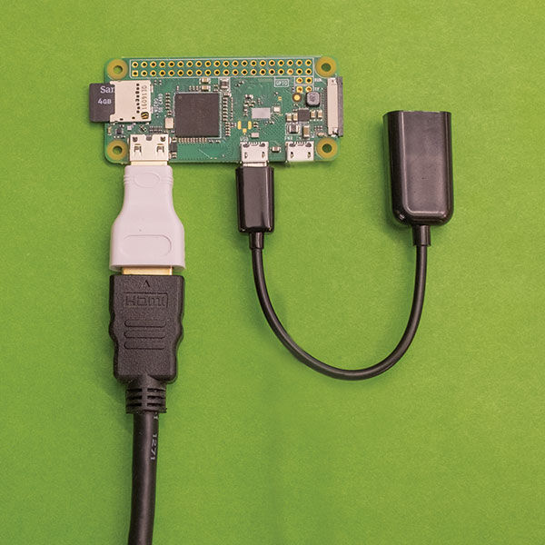

Raspberry Pi Zero Gaming Console
================================

Description
-------------------
Using [RetroPie][retro-pie-site], an operating system dedicated to retro-gaming on the Raspberry Pi, you can assemble a console for on-the-go gaming.

Time estimate
-------------
30 minutes

Difficulty
----------
Very Easy

Ingredients
-----------
#### Physical Ingredients
- 1x Raspberry Pi Zero
- 1x HDMI cable
- 1x HDMI display (most modern televisions have an HDMI port)
- 1x mini HDMI to HDMI adapter
- 1x micro USB AC power plug
- 1x micro USB cable
- 1x micro USB to USB adapter
- 1x USB controller (I use a XBox 360 Controller with the wireless PC USB adapter)
- 1x keyboard (optional, but recommended for setup)
- 1x USB hub (optional)

#### Digital Ingredients
- [RetroPie for Raspberry Pi Zero][retro-pie-install]
- [Win32DiskImager][win32-disk-imager-download] (for Windows)
- [ApplePi Baker][applepi-baker-download] (for Mac)

#### Knowledge Needed
- How to download and manipulate files on your computer
- How to extract .gz files on your computer
- Configuration of your WiFi access point (optional)

Recipe
------
**Note:** if you get stuck, [RetroPie][retro-pie-site] also has a guide [here][retro-pie-guide]

#### Step 1 - Download and Prepare RetroPie
(Raspberry Pi has an image installation guide covering more options, [here][generic-image-install-guide])

- Visit [RetroPie][retro-pie-download] and click the download button for "Raspberry Pi 0/1"
- Extract the file you just downloaded (ends with ".gz"). You should end up with an image file (ends with ".img"). Save the image file somewhere you can get to it in the next step.
- Download and install [Win32DiskImager][win32-disk-imager-download] (for Windows) or [ApplePi Baker][applepi-baker-download] (for Mac)

#### Step 2 - Install RetroPie
**IMPORTANT:** In the following steps, be careful to only select your SD card drive - all the data on the selected drive will be overwritten and lost!

- Insert your microSD card (via SD adapter if needed) into your computer
- **(for Windows)** Open Win32 Disk Imager and select the image file you downloaded. Then, under "Device", make sure the drive for your SD card is selected and click the "Write" button.

- **(for Mac)** Open ApplePi Baker and look for the "Pi-Crust" section. Make sure your SD card is selected. Now look for the "Pi-Ingredients" section. Load the image file you downloaded, and click the "Restore Backup" button.


#### Special Step - Patch RetroPie
As of this writing, RetroPie hasn't been updated to handle the new Pi Zero W configuration. We expect this will be fixed soon, but in the meantime, if your Pi Zero hangs on a rainbow-colored screen, you may need to do the following:

- Download [this file](rpi0w-retropie-fix.zip), unzip the files, and copy them into the root (boot) directory of your microSD card (overwrite any existing files if prompted).

#####Alternatively:
You can get these same files directly from raspberrypi.org

- [Download the latest "Raspbian Lite" image](https://downloads.raspberrypi.org/raspbian_lite_latest), and extract the image file from the zip file.
- Use a program like [7-zip](http://www.7-zip.org) to open the image file and extract the `0.fat` file.
- Use the same program to open `0.fat`. Once open, extract the following files:
```
bcm2708-rpi-0-w.dtb
bootcode.bin
fixup.dat
start.elf
```
- Put those files into the root (boot) directory of your microSD card (overwrite any existing files if prompted).

#### Step 3 - Plugging in your cables and power on RetroPie
- Insert your microSD card into your Pi Zero:

- Plug your micro USB to USB adapter into the micro USB port on the Pi Zero labeled "USB":

- (optional) If you have a USB hub that you'd like to use, plug it into the USB adapter now. This will allow you to plug in multiple USB devices at the same time, such as a controller and keyboard

- (optional) If you have a keyboard you'd like to use, plug it into the USB Hub or adapter now. Otherwise, plug your USB controller into the USB hub or adapter
- Plug in your mini HDMI to HDMI adapter into the port on the Pi Zero labeled "HDMI":

- Connect your Pi to the HDMI port of your HDMI display with an HDMI cable
- This next step will actually power on and boot the Raspberry Pi as soon as you plug in, so double check that everything so far is plugged in and your display is set to the correct HDMI input.
- Plug in the micro USB AC power plug into the micro USB port on the Pi Zero labeled "PWR IN":

- After a few seconds, you should see the RetroPie load screen:


#### Step 4 - Configuring RetroPie
- From here on out, RetroPie will guide you through configuring your system. It will ask to assign controller buttons, and make the menu available for all kinds of setting changes.


[applepi-baker-download]: https://www.tweaking4all.com/?wpfb_dl=94
[generic-image-install-guide]: https://www.raspberrypi.org/documentation/installation/installing-images/
[retro-pie-download]: https://retropie.org.uk/download/
[retro-pie-guide]: https://retropie.org.uk/docs/First-Installation/
[retro-pie-install]: https://github.com/RetroPie/RetroPie-Setup/releases/download/4.1/retropie-4.1-rpi1_zero.img.gz
[retro-pie-site]: https://retropie.org.uk/
[win32-disk-imager-download]: https://sourceforge.net/projects/win32diskimager/files/latest/download
