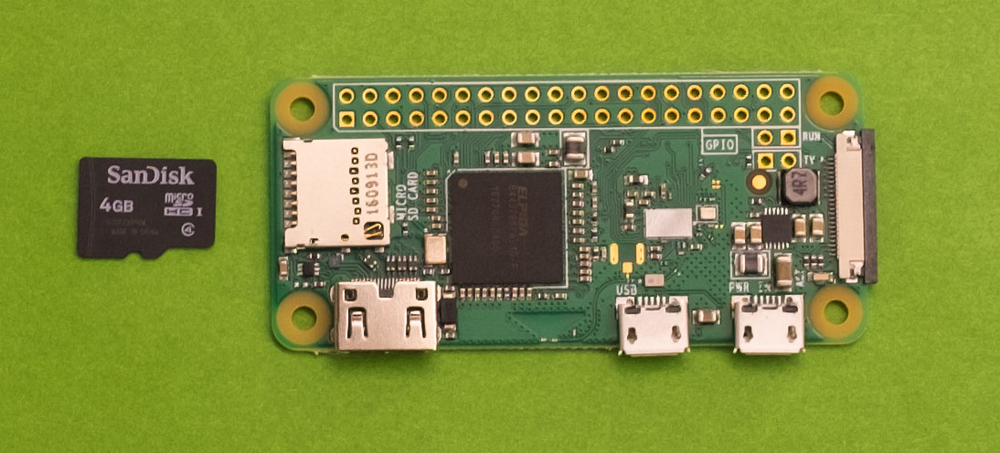
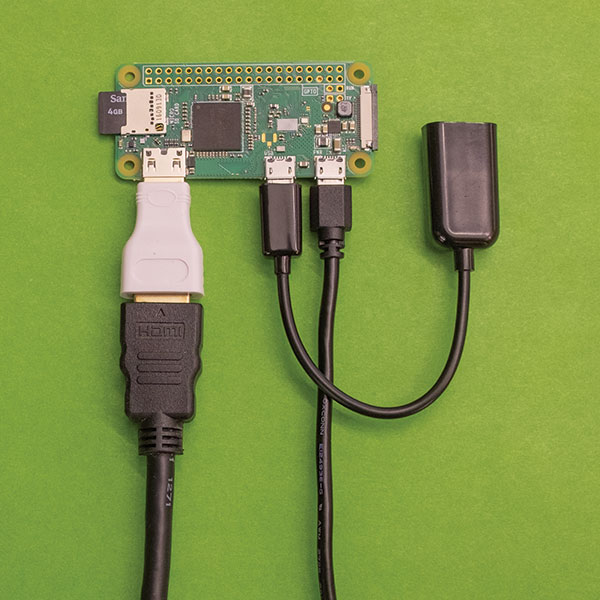

Raspberry Pi Zero Docker Host
=============================

Description
-------------------
[Docker][Docker] containers are a way to very easily install and run services and complex applications without having to worry much about dependencies or prerequisites, or interference with other services on a system. It's for installing server-based things like [WordPress][wordpress] or [MySQL][mysql], and now you can try it out on your Raspberry Pi!
Using [HypriotOS][hypriot], a Linux distribution for running [Docker][Docker] containers the Raspberry Pi, you can create one [Docker][Docker] host, or a whole swarm!

Time estimate
-------------
1 hour

Difficulty
----------
medium

Ingredients
-----------
#### Physical things
- 1x Raspberry Pi Zero W
- 1x micro SD card
- 1x micro USB AC power plug
- 1x micro USB cable

#### Virtual things
- A copy of [HypriotOS][hypriot-download]
- An SSH client:
 On Mac, you already have one. It's just called `ssh` and you access it from your `terminal`
 On Windows, you need a program like [puTTY][putty]
- A way to correctly write your `.img` file to the SD card:
 On Mac, you can use `dd` from the terminal, or you can use [ApplePi Baker][applepi-baker-download]
 On Windows, you'll need [Win32DiskImager][win32-disk-imager-download]

#### Knowledge things
- How to download and manipulate files on your computer
- How to extract `.zip` files on your computer
- How to use a plain text editor
- Configuration of your WiFi access point

Tutorial (for Windows)
----------------------
**Note:** if you get stuck, [HypriotOS][hypriot] also has a guide [here][hypriot-getting-started]

#### Step 1 - Download and Prepare HypriotOS
(Raspberry Pi has an image installation guide covering more options, [here][generic-image-install-guide])

- Download the most recent HypriotOS image file that you find [here][hypriot-download]
- Extract the file you just downloaded (ends with ".zip"); you should end up with an image file (ends with ".img"). Save the image file somewhere you can get to it in the next step.
- Download and install [Win32DiskImager][win32-disk-imager-download] (Windows only) or [ApplePi Baker][applepi-baker-download] (Mac only)

#### Step 2 - Install HypriotOS
**IMPORTANT:** in the following steps, be careful to only select your SD card drive - all the data on the selected drive will be overwritten and lost!

Insert your microSD card (via SD adapter if needed) into your computer, then use the tool of your choice to install your image onto the SD card. It isn't enough to simply copy the file there, so you'll need to proceed with a tool:

- **(Windows)** Open Win32 Disk Imager and select the image file your downloaded. Then, under "Device", make sure the drive for your SD card is selected and click the "Write" button.
- **(Mac)** Open ApplePi Baker and look for the "Pi-Crust" section. Make sure your SD card is selected. Now look for the "Pi-Ingredients" section. Load the image file you downloaded, and click the "Restore Backup" Button

#### Step 3 - Use a Plain Text Editor to Configure HypriotOS for WiFi
- Close the tool that you were using to install the image once it has completed.
- Remove the microSD card from your computer for a moment, then
- Reinsert your microSD card so that your computer can see it as a regular storage device with files on it.
- Using your plain text editor, _(e.g. notepad on Windows or TextEdit for Mac)_ open `device-init.yaml`
- Edit the lines under `# optional wireless network settings`:
- First, delete the `#` that you see at the beginning of the three last lines, but leave the rest of the lines alone. This is called "uncommenting" by programmers.
- Then change `ssid: "MyNetwork"` so that your own WiFi network name is between the quotation marks.
- Finally, change `password: "secret_password"` so that your WiFi password is between the quotation marks.
- Optionally, you may like to name your Pi. Change the `hostname` to whatever you like, but don't forget it!
- Now be absolutely certain that you are saving this file as **PLAIN TEXT**
- Safely remove your SD card from your computer.

#### Step 4 - Plugging in your cable and power on HypriotOS
- Insert your microSD card into your Pi Zero:

- Power on and boot the Raspberry Pi by plugging in the micro USB AC power plug into the micro USB port on the Pi Zero labeled "PWR IN":

- Count to ten or so while HypriotOS boots up.

#### Step 4 - Connect to HypriotOS
- Here's where your SSH client comes in. Use it to connect to your Raspberry Pi over WiFi. If you didn't change the hostname in `device-init.yaml` then you want to connect to the user `pirate@black-pearl.local`, otherwise use the hostname you chose: `pirate@hostname.local`
- The default password for `pirate` is `hypriot`
- You should see a screen that looks like this:
 

#### Step 5 - Your First Docker Container!
- Let's start small, and set up a tiny webserver. At your command line prompt, type:
`docker run -d -p 80:80 hypriot/rpi-busybox-httpd`
This will download and start the Docker image hypriot/rpi-busybox-httpd which contains a tiny webserver.
- Check to see if your container is running:
`docker ps`
You should see the container you just started in the container list.
- Now the magic happens. Open any browser you like, and navigate to the `hostname.local` or the IP address of your Raspberry Pi. You'll see a black background, with the Raspberry Pi and Docker logos side-by-side, served up by your own Raspberry Pi webserver, running inside of a Docker container!

#### Going Further
Most of this guide follows the steps in [HypriotOS's Getting Started Guide][hypriot-getting-started]. You Should definitely check out that documentation, and their references. But you may also want to know more about Docker specifically, and for that you'll want to see [Docker's Own Getting Started Guide][docker-getting-started] - bearing in mind that your Raspberry Pi is an ARM architecture device, and so you'll have to choose your Docker images carefully if you want them to work correctly.

[applepi-baker-download]: https://www.tweaking4all.com/?wpfb_dl=94
[generic-image-install-guide]: https://www.raspberrypi.org/documentation/installation/installing-images/
[Docker]: https://www.docker.com/
[win32-disk-imager-download]: https://sourceforge.net/projects/win32diskimager/files/latest/download
[hypriot-download]:https://blog.hypriot.com/downloads/
[wordpress]:https://wordpress.org/
[mysql]:https://www.mysql.com/
[hypriot]:https://blog.hypriot.com/
[putty]:https://www.putty.org/
[hypriot-getting-started]:https://blog.hypriot.com/getting-started-with-docker-on-your-arm-device/
[docker-getting-started]:https://docs.docker.com/engine/getstarted/